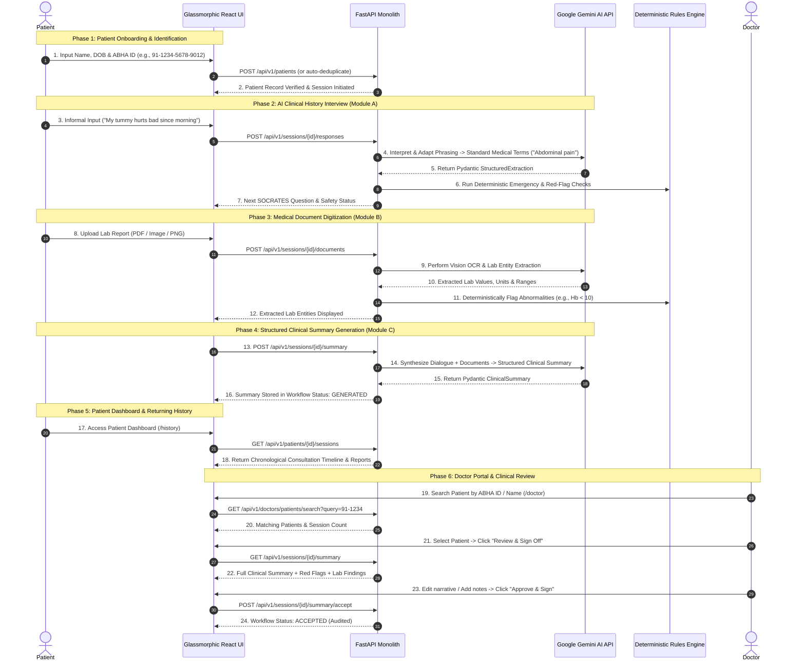

# Health AI Platform: End-to-End Patient Onboarding & Clinical Review Timeline

This document outlines the complete chronological timeline and architecture of the **Health AI Pre-Consultation Platform (SIH Problem Statement 047)**, powered by **Google Gemini AI (`gemini-1.5-flash`)**, structured Pydantic validation, and deterministic safety guardrails.

---

## Architectural Principle: AI + Deterministic Safety Engine

> [!IMPORTANT]
> **The LLM (Gemini AI) is NOT the source of truth.**
> - **Gemini AI Role**: Interprets natural language, adapts informal/colloquial phrasing, extracts structured clinical entities (lab values, medications, symptoms), and generates structured narrative summaries.
> - **Deterministic Code Role**: Validates schemas via Pydantic, evaluates red-flag emergency safety rules (e.g. chest pain, dyspnea), manages state machine transitions (SOCRATES protocol), controls database persistence, and enforces ABDM/FHIR consent boundaries.

---

## 1. Complete End-to-End Timeline



---

## 2. Step-by-Step Breakdown

### Step 1: Patient Onboarding & ABHA Verification (`/identify`)
- **Action**: Patient enters first name, last name, date of birth, gender, and ABHA ID (`91-1234-5678-9012`).
- **Backend Flow**: `PatientService.create_or_get_patient` verifies if the patient already exists in the PostgreSQL/SQLite database to prevent duplicates.
- **Result**: Generates/retrieves `patient_id` and starts a new consultation session (`session_id`).

---

### Step 2: AI-Powered Clinical Interview (`/converse` — Module A)
- **Action**: The patient talks to the AI assistant in natural language, using non-conventional or informal expressions (e.g. *"head is spinning and I feel like puking"*).
- **Gemini AI Execution**: `GeminiLLMProvider` processes the turn:
  1. Maps *"head is spinning"* $\rightarrow$ **Dizziness**.
  2. Maps *"puking"* $\rightarrow$ **Vomiting**.
  3. Returns a validated `StructuredExtraction` object.
- **Deterministic State Machine**: `InterviewStateMachine` advances systematically through SOCRATES sections:
  - `CHIEF_COMPLAINT` $\rightarrow$ `HPI` $\rightarrow$ `SOCRATES` (Site, Onset, Character, Radiation, Associations, Time, Exacerbating, Severity) $\rightarrow$ `PMH` $\rightarrow$ `DRUG_HISTORY` $\rightarrow$ `ALLERGY_HISTORY` $\rightarrow$ `COMPLETED`.
- **Deterministic Red Flags**: `SafetyRulesEngine` checks input for emergency triggers (e.g. acute chest pain radiating to jaw). If flagged, immediately alerts the patient with standard emergency guidance without relying on LLM decision making.

---

### Step 3: Medical Document Digitization (`/documents` — Module B)
- **Action**: Patient uploads lab report PDFs or PNG images (e.g., CBC Blood Test, Lipid Profile).
- **Gemini AI Execution**: `DocumentService` passes raw extracted text or image stream to Gemini AI to extract structured lab entities (`LAB_RESULT`, `MEDICATION`, `VITAL`).
- **Deterministic Lab Checks**:
  - Compares numerical extracted values against standard reference ranges (e.g. Hemoglobin `8.5 g/dL` vs normal range `12.0 - 15.5 g/dL`).
  - Deterministically tags `is_abnormal = True` and flags for physician review.

---

### Step 4: Structured Summary Generation (`/summary` — Module C)
- **Action**: Click "Generate Summary".
- **Gemini AI Execution**: `SummaryService` compiles full conversation turn history + document extractions and prompts Gemini AI (`gemini-1.5-flash`) with structured schema rules.
- **Pydantic Validation**:
  - Validates output into `ClinicalSummary` schema (Chief Complaint, HPI, Past Medical History, Medications, Lab Findings, Explicit Information Gaps).
  - Explicitly documents unstated information gaps (e.g., *"Family cardiac history not provided"*).
- **Persistence**: Saved in database with `workflow_status: GENERATED` and model metadata (`llm_model: gemini-1.5-flash`, `prompt_version: clinical_summary_v1`).

---

### Step 5: Patient Dashboard & Past History (`/history`)
- **Action**: Patient logs in or searches using ABHA ID to view previous consultations.
- **Backend Flow**: `GET /api/v1/patients/{id}/sessions` returns a complete chronological list of past sessions.
- **Feature**: Patient can switch active sessions with one click to resume conversation or view past summaries.

---

### Step 6: Doctor Portal & Clinical Review (`/doctor`)
- **Action**: Doctor searches patient by ABHA ID (`91-1234`), Patient ID, or Name.
- **Backend Flow**: `GET /api/v1/doctors/patients/search` & `GET /api/v1/doctors/patients/{id}/full-history`.
- **Physician Review**:
  1. Doctor inspects AI-synthesized narrative summary + preserved red flags + abnormal lab values.
  2. Doctor can inline-edit the narrative summary or add custom physician notes.
  3. Doctor clicks **Approve & Sign** (`POST /api/v1/sessions/{id}/summary/accept`) or **Reject / Request Changes** (`POST /api/v1/sessions/{id}/summary/reject`).
  4. Audit log event is committed storing physician ID (`dr_physician_1`) and timestamp.

---

## 3. How to Enable Google Gemini AI in Your System

To run the entire platform with Google Gemini AI (`gemini-1.5-flash`):

1. Add your **Gemini API key** to `backend/.env`:
   ```env
   AI_PROVIDER=gemini
   GEMINI_API_KEY=your_actual_gemini_api_key_here
   ```

2. Start backend server:
   ```bash
   cd backend
   python -m uvicorn app.main:app --reload
   ```

3. Start frontend React client:
   ```bash
   cd frontend
   npm run dev
   ```

All dialogue interpretation, informal phrasing adaptation, document entity extraction, and clinical summary generation will now execute live through **Google Gemini AI**!
